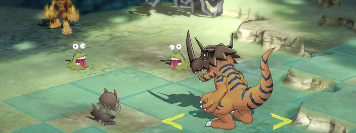

# Nome do projeto
> Um resumo curto sobre o que faz

Um ou dois parágrafos sobre o que seu projeto faz




## Instalação

Mac OS X & Linux:

```sh
npm install --save
```

Windows:

```sh
edit autoexec.bat
```

## Exemplo de uso

Exemplo de como seria o projeto, e que é útil, dividir em partes menores e se possivel com imagens

## Ambiente de desenvolvimento

Descrever como instalar e preparar qualquer dependencia de desenvolvimento p/ projeo possa ser execuutado localmente e pessoas possam contribuir.
Informar o que precisar ter pra instalar.


## Histórico de Atualizações

* 0.2.1
    * CHANGE: Atualização dos docs (código não foi alterado)
* 0.2.0
    * ADD: Adicinado a função `inicializar()`

## Meta

Gustavo NiD - [@NiDft](https://twitter.com/NiDft) - gugu.ti@gmail.com
Distribuido sobre a licença. veja `LICENÇA`para mais informações.
[https://github.com/GustavoNiD/Gustavo-Geek]
[https://github.com/GustavoNiD]